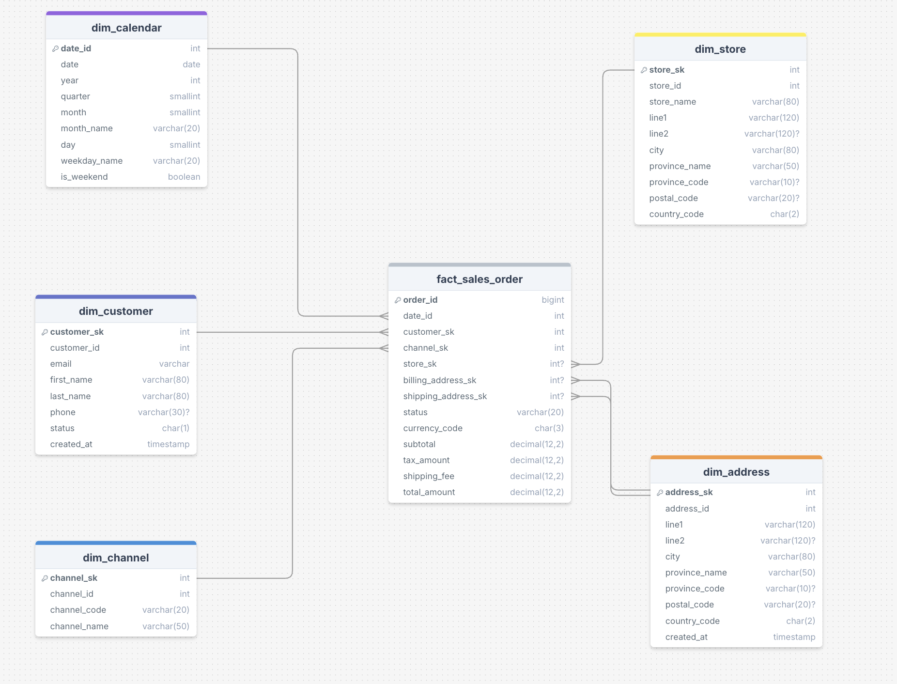
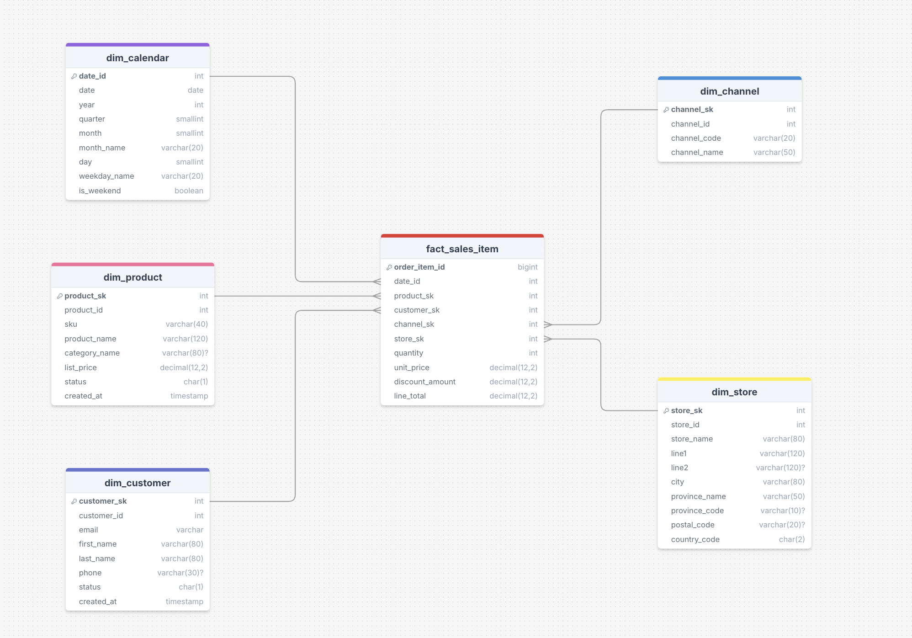
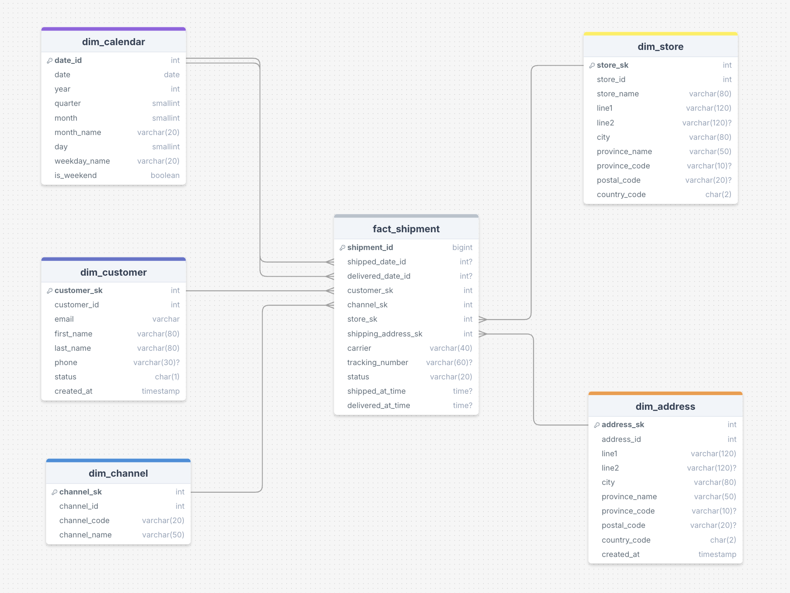
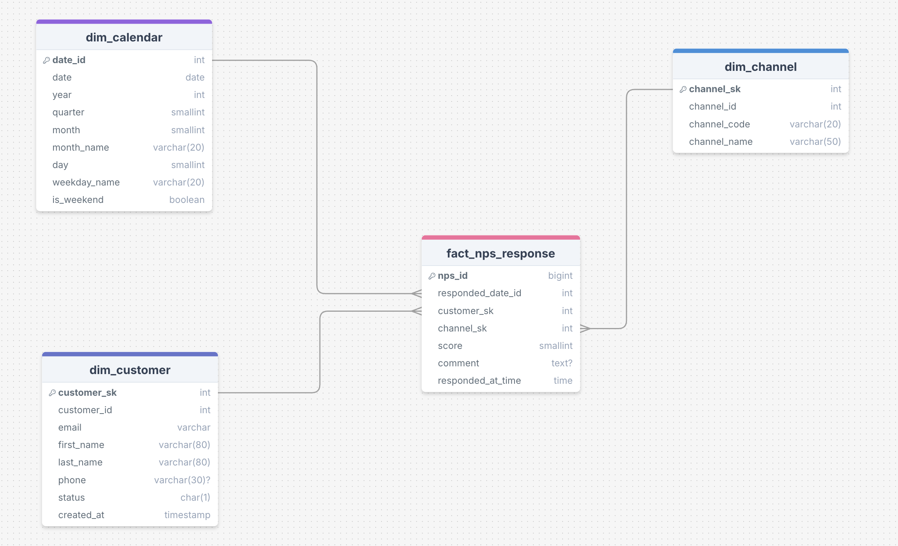
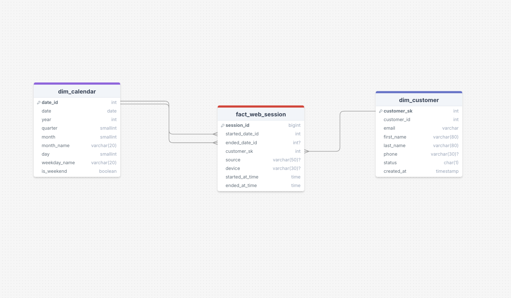
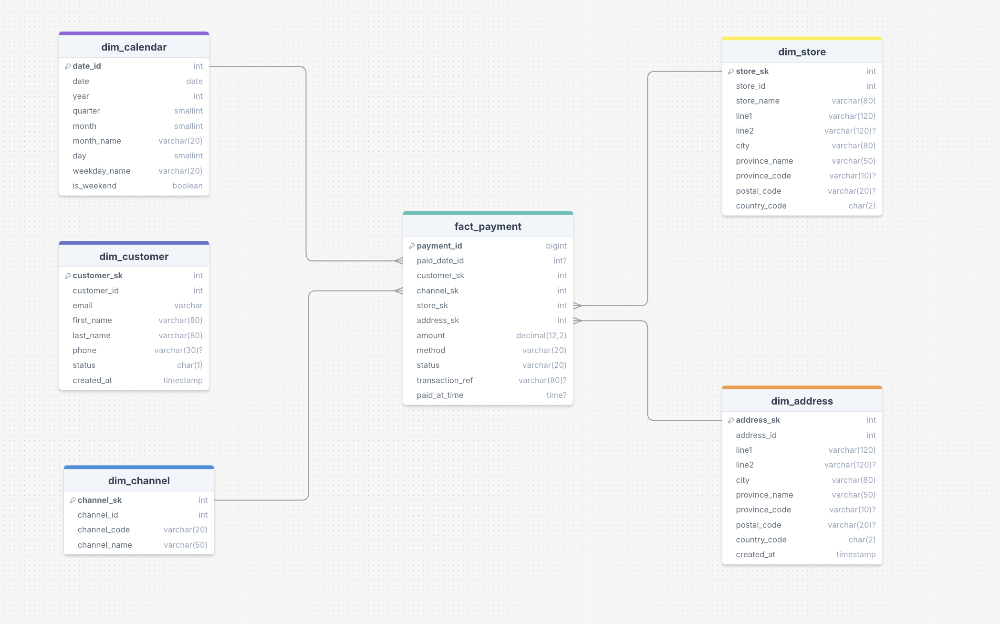

# Proyecto EcoBottle - Diseño e Implementación de un Data Warehouse Comercial


## 1. Introducción y Objetivos
El presente proyecto tiene como finalidad **diseñar e implementar un mini ecosistema de datos comercial**, aplicando un proceso **ETL completo (Extracción, Transformación y Carga)** que permita la creación de un **modelo dimensional (esquema estrella)** para análisis y reporting.

El caso de negocio corresponde a **EcoBottle**, una empresa dedicada a la venta de botellas reutilizables a través de canales físicos y digitales.  

El propósito es centralizar la información de distintas fuentes, **desnormalizar las tablas operativas** y construir un **Data Warehouse (DW)** optimizado para consultas analíticas.

---

## 2. Flujo de Datos (ETL)
El proyecto implementa un proceso ETL compuesto por tres fases principales:

1. **Extracción (Extract):**  
   Se leen los archivos `.csv` provenientes de sistemas operacionales desde el directorio `raw/`.

2. **Transformación (Transform):**  
   Es la etapa más importante del proceso, donde se aplica el **modelado dimensional** según la metodología de **Kimball**:
   - **Limpieza de datos:** estandarización de formatos de fecha, eliminación de duplicados y corrección de valores nulos.
   - **Desnormalización:** combinación de tablas normalizadas en estructuras planas que representan entidades de negocio.
   - **Creación de Dimensiones (Dims):** se generan las tablas maestras (`dim_product`, `dim_customer`, `dim_channel`, etc.) asignando una **clave sustituta (SK)**.
   - **Creación de Hechos (Facts):** se construyen las tablas de hechos (`fact_order`, `fact_payment`, etc.) vinculando las dimensiones mediante sus claves SK.

3. **Carga (Load):**  
   Los DataFrames finales del proceso ETL se exportan como archivos `.csv` dentro del directorio `dw/`, listos para ser utilizados en herramientas de BI.

---

## 3. ⚙️ Instrucciones de Ejecución

Se deben seguir estos pasos para replicar el proceso ETL y generar los archivos finales:

1. **Clonar el repositorio**
   ```bash
   git clone https://github.com/santialmironn/mkt_tp_final.git
   cd mkt_tp_final
   ```
2. **Crear entorno virtual**
   ```bash
   # macOS / Linux
   python -m venv venv
   source venv/bin/activate 

   # Windows 
   python -m venv venv
   .\venv\Scripts\activate
   ```    
3. **Instalar dependencias**
   ```bash
   pip install -r requirements.txt
   ```
4. **Ejecutar el proceso ETL**
   ```bash
   python main.py
   ```
   El archivo `main.py` actúa como **orquestador del pipeline ETL**, ejecutando en orden las fases de extracción, transformación y carga, y generando las tablas del Data Warehouse en el directorio `dw/`.
---

## 4. Modelo de Datos (Esquema Estrella)
El modelo dimensional está conformado por **seis esquemas estrella**, cada uno asociado a un proceso clave del negocio.

###  Fact_Sales_Order  
📦 Representa las órdenes o pedidos de los clientes.



### Fact_Sales_Item  
🧾 Detalle de los productos vendidos por pedido.



### Fact_Shipment  
🚚 Información de los envíos y entregas.



### Fact_Nps_Response  
💬 Respuestas de encuestas de satisfacción (NPS).



### Fact_Web_Session  
🌐 Registro de sesiones web y comportamiento del cliente.



### Fact_Payment  
💰 Pagos realizados por los clientes.



---

## 5. Diccionario de Datos
El siguiente diccionario de datos documenta las tablas que conforman el modelo dimensional del proyecto **EcoBottle**.  
Incluye la definición de campos, tipos de datos y claves, facilitando la comprensión y el mantenimiento del Data Warehouse.

---

### 5.1 Dimensiones

#### `dim_product`

| Campo           | Tipo de dato  | Descripción                                               |
| :-------------- | :------------ | :-------------------------------------------------------- |
| `product_sk`    | INT           | Clave sustituta del producto (PK en el DW).               |
| `product_id`    | INT           | Identificador original del producto en el sistema fuente. |
| `product_name`  | VARCHAR(120)  | Nombre del producto.                                      |
| `sku`           | VARCHAR(40)   | Código único de producto (Unique).                        |
| `category_name` | VARCHAR(80)   | Categoría/familia del producto.                           |
| `list_price`    | DECIMAL(12,2) | Precio de lista.                                          |
| `status`        | CHAR(1)       | Estado del producto (`A` = activo, `I` = inactivo).       |
| `created_at`    | TIMESTAMP     | Fecha y hora de creación del producto.                    |

---

#### `dim_customer`

| Campo | Tipo de dato | Descripción |
|:------|:-------------|:-------------|
| `customer_sk` | INT | Clave sustituta del cliente (PK). |
| `customer_id` | INT | Identificador original del cliente. |
| `email` | VARCHAR(120) | Correo electrónico. |
| `first_name` | VARCHAR(80) | Nombre. |
| `last_name` | VARCHAR(80) | Apellido. |
| `phone` | VARCHAR(30) | Teléfono. |
| `status` | CHAR(1) | Estado (`A`=Activo, `I`=Inactivo). |
| `created_at` | TIMESTAMP | Fecha de alta. |

---

#### `dim_channel`

| Campo          | Tipo de dato | Descripción                                   |
| :------------- | :----------- | :-------------------------------------------- |
| `channel_sk`   | INT          | Clave sustituta del canal (PK).               |
| `channel_id`   | INT          | Identificador original del canal.             |
| `channel_code` | VARCHAR(20)  | Código del canal (`ONLINE`, `OFFLINE`, etc.). |
| `channel_name` | VARCHAR(50)  | Nombre descriptivo del canal.                 |

---

#### `dim_store`

| Campo           | Tipo de dato | Descripción                              |
| :-------------- | :----------- | :--------------------------------------- |
| `store_sk`      | INT          | Clave sustituta de la tienda (PK).       |
| `store_id`      | INT          | Identificador original de la tienda.     |
| `store_name`    | VARCHAR(80)  | Nombre de la sucursal.                   |
| `line1`         | VARCHAR(120) | Dirección principal.                     |
| `line2`         | VARCHAR(120) | Dirección adicional (piso, depto, etc.). |
| `city`          | VARCHAR(80)  | Ciudad donde se encuentra la tienda.     |
| `province_name` | VARCHAR(50)  | Provincia de la tienda.                  |
| `province_code` | VARCHAR(10)  | Código de provincia.                     |
| `postal_code`   | VARCHAR(20)  | Código postal.                           |
| `country_code`  | CHAR(2)      | Código de país (`AR`).                   |

---

#### `dim_address`

| Campo           | Tipo de dato | Descripción                               |
| :-------------- | :----------- | :---------------------------------------- |
| `address_sk`    | INT          | Clave sustituta de la dirección (PK).     |
| `address_id`    | INT          | Identificador original de la dirección.   |
| `line1`         | VARCHAR(120) | Calle y número (dirección principal).     |
| `line2`         | VARCHAR(120) | Complemento (piso, depto, etc.).          |
| `city`          | VARCHAR(80)  | Ciudad.                                   |
| `province_name` | VARCHAR(50)  | Provincia asociada a la dirección.        |
| `province_code` | VARCHAR(10)  | Código de provincia.                      |
| `postal_code`   | VARCHAR(20)  | Código postal.                            |
| `country_code`  | CHAR(2)      | Código de país (`AR`).                    |
| `created_at`    | TIMESTAMP    | Fecha y hora de registro de la dirección. |

---

#### `dim_calendar`

| Campo          | Tipo de dato | Descripción                                           |
| :------------- | :----------- | :---------------------------------------------------- |
| `date_id`      | INT          | Identificador de fecha en formato `YYYYMMDD` (PK).    |
| `date`         | DATE         | Fecha completa.                                       |
| `year`         | INT          | Año calendario.                                       |
| `quarter`      | SMALLINT     | Trimestre del año (1–4).                              |
| `month`        | SMALLINT     | Número de mes (1–12).                                 |
| `month_name`   | VARCHAR(20)  | Nombre del mes.                                       |
| `day`          | SMALLINT     | Día del mes.                                          |
| `weekday_name` | VARCHAR(20)  | Nombre del día de la semana.                          |
| `is_weekend`   | BOOLEAN      | Indica si la fecha es fin de semana (`TRUE`/`FALSE`). |

---

### 5.2 Hechos

#### `fact_sales_order`

| Campo                 | Tipo de dato  | Descripción                                                          |
| :-------------------- | :------------ | :------------------------------------------------------------------- |
| `order_id`            | BIGINT        | Identificador único del pedido (PK del hecho).                       |
| `date_id`             | INT           | Clave de fecha (FK → `dim_calendar.date_id`).                        |
| `customer_sk`         | INT           | Cliente asociado (FK → `dim_customer.customer_sk`).                  |
| `channel_sk`          | INT           | Canal de venta (FK → `dim_channel.channel_sk`).                      |
| `store_sk`            | INT           | Tienda física (FK → `dim_store.store_sk`). Puede ser NULL en online. |
| `billing_address_sk`  | INT           | Dirección de facturación (FK → `dim_address.address_sk`).            |
| `shipping_address_sk` | INT           | Dirección de envío (FK → `dim_address.address_sk`).                  |
| `status`              | VARCHAR(20)   | Estado del pedido (`CREATED`, `PAID`, `CANCELLED`, etc.).            |
| `currency_code`       | CHAR(3)       | Código de moneda (`ARS`).                                            |
| `subtotal`            | DECIMAL(12,2) | Monto subtotal de la orden.                                          |
| `tax_amount`          | DECIMAL(12,2) | Monto total de impuestos.                                            |
| `shipping_fee`        | DECIMAL(12,2) | Costo de envío.                                                      |
| `total_amount`        | DECIMAL(12,2) | Importe total del pedido.                                            |

---

#### `fact_sales_item`

| Campo             | Tipo de dato  | Descripción                                                |
| :---------------- | :------------ | :--------------------------------------------------------- |
| `order_item_id`   | BIGINT        | Identificador de línea de pedido (PK).                     |
| `date_id`         | INT           | Fecha de la venta (FK → `dim_calendar.date_id`).           |
| `product_sk`      | INT           | Producto vendido (FK → `dim_product.product_sk`).          |
| `customer_sk`     | INT           | Cliente (FK → `dim_customer.customer_sk`).                 |
| `channel_sk`      | INT           | Canal (FK → `dim_channel.channel_sk`).                     |
| `store_sk`        | INT           | Tienda (FK → `dim_store.store_sk`).                        |
| `quantity`        | INT           | Cantidad de unidades vendidas.                             |
| `unit_price`      | DECIMAL(12,2) | Precio unitario al momento de la venta.                    |
| `discount_amount` | DECIMAL(12,2) | Descuento aplicado a la línea.                             |
| `line_total`      | DECIMAL(12,2) | Importe total de la línea (cantidad × precio − descuento). |

---

#### `fact_payment`

| Campo                | Tipo de dato  | Descripción                                                    |
| :------------------- | :------------ | :------------------------------------------------------------- |
| `payment_id`         | BIGINT        | Identificador único del pago (PK).                             |
| `paid_date_id`       | INT           | Fecha de pago (FK → `dim_calendar.date_id`).                   |
| `customer_sk`        | INT           | Cliente que realiza el pago (FK → `dim_customer.customer_sk`). |
| `channel_sk`         | INT           | Canal asociado al pedido (FK → `dim_channel.channel_sk`).      |
| `store_sk`           | INT           | Tienda física (FK → `dim_store.store_sk`). Puede ser NULL.     |
| `address_sk`      | INT           | Dirección asociada al pago (FK → `dim_address.address_sk`).    |
| `amount`             | DECIMAL(12,2) | Importe abonado.                                               |
| `method`             | VARCHAR(20)   | Método de pago (`CARD`, `CASH`, `TRANSFER`, `GATEWAY`, etc.).  |
| `status`             | VARCHAR(20)   | Estado del pago (`PENDING`, `PAID`, `FAILED`, etc.).           |
| `transaction_ref`    | VARCHAR(80)   | Referencia o identificador de la transacción.                  |
| `paid_at_time`       | TIME          | Hora en la que se registró el pago.                            |

---

#### `fact_shipment`

| Campo                 | Tipo de dato | Descripción                                               |
| :-------------------- | :----------- | :-------------------------------------------------------- |
| `shipment_id`         | BIGINT       | Identificador único del envío (PK).                       |
| `shipped_date_id`     | INT          | Fecha en que se despachó el pedido (FK → `dim_calendar`). |
| `delivered_date_id`   | INT          | Fecha de entrega (FK → `dim_calendar`).                   |
| `customer_sk`         | INT          | Cliente destinatario (FK → `dim_customer`).               |
| `channel_sk`          | INT          | Canal asociado (FK → `dim_channel`).                      |
| `store_sk`            | INT          | Tienda de origen (FK → `dim_store`). Puede ser NULL.      |
| `shipping_address_sk` | INT          | Dirección de entrega (FK → `dim_address`).                |
| `carrier`             | VARCHAR(40)  | Empresa de transporte.                                    |
| `tracking_number`     | VARCHAR(60)  | Número de seguimiento del envío.                          |
| `status`              | VARCHAR(20)  | Estado del envío (`READY`, `SHIPPED`, `DELIVERED`, etc.). |
| `shipped_at_time`     | TIME         | Hora de despacho.                                         |
| `delivered_at_time`   | TIME         | Hora de entrega.                                          |

---

#### `fact_web_session`

| Campo             | Tipo de dato | Descripción                                                                                     |
| :---------------- | :----------- | :---------------------------------------------------------------------------------------------- |
| `session_id`      | BIGINT       | Identificador único de sesión (PK).                                                             |
| `started_date_id` | INT          | Fecha de inicio (FK → `dim_calendar.date_id`).                                                  |
| `ended_date_id`   | INT          | Fecha de fin (FK → `dim_calendar.date_id`).                                                     |
| `customer_sk`     | INT          | Cliente identificado (FK → `dim_customer.customer_sk`). Puede ser NULL si la sesión es anónima. |
| `source`          | VARCHAR(50)  | Fuente de tráfico (`ads`, `direct`, `referral`, etc.).                                          |
| `device`          | VARCHAR(30)  | Dispositivo (`desktop`, `mobile`, `tablet`).                                                    |
| `started_at_time` | TIME         | Hora de inicio de la sesión.                                                                    |
| `ended_at_time`   | TIME         | Hora de finalización de la sesión.                                                              |

---

#### `fact_nps_response`

| Campo               | Tipo de dato | Descripción                                                             |
| :------------------ | :----------- | :---------------------------------------------------------------------- |
| `nps_id`            | BIGINT       | Identificador único de la respuesta (PK).                               |
| `responded_date_id` | INT          | Fecha de respuesta (FK → `dim_calendar.date_id`).                       |
| `customer_sk`       | INT          | Cliente que responde (FK → `dim_customer.customer_sk`). Puede ser NULL. |
| `channel_sk`        | INT          | Canal en el que se tomó la encuesta (FK → `dim_channel.channel_sk`).    |
| `score`             | SMALLINT     | Puntaje NPS asignado (0 a 10).                                          |
| `comment`           | TEXT         | Comentario abierto del cliente (opcional).                              |
| `responded_at_time` | TIME         | Hora en que se registró la respuesta.                                   |
